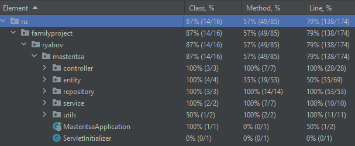
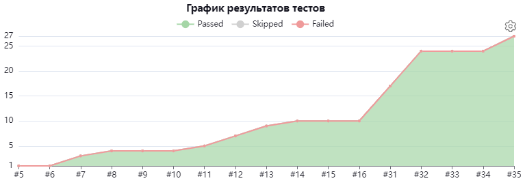

# 🔻🔻🔻ПРОЧИТАЙ ДО КОНЦА🔻🔻🔻
# Добро пожаловать на страницу проекта сайта для украшений ручной работы. 🙋‍♂️
## Данный проект является учебным. Стек проекта 🖥️
- Maven
- Spring Boot, Spring Web, Spring Security
- JUnit5, Mockito
- Postgresql
- Hibernate
- Thymeleaf

## Уже выполненные цели ✅
- 100% покрытие unit-тестами слоя сервисов
- 100% покрытие unit-тестами слоя контроллеров
- 100% покрытие unit-тестами слоя репозитория
- Написание документации javadoc на каждый класс на русском языке и английском языке
- Подключение Thymeleaf и вывод с его помощью данных из БД
- Автоматизация тестирования за счет Jenkins

## Планы на ближайшее будущее (до конца января) 📓

- Кидать между слоями приложения DTO, а не entity
- Подключить к проекту Liquibase
- Добиться 80% покрытия unit-тестами
- Добавить интеграционные тесты
- Добавить в свой стек проекта фреймворк Selenide
- Добавить авторизацию пользователей и страницу логина/регистрации (соответственно)
- Добавить модуль мониторинга статистики сайта (скорее всего от Яндекса)
- Провести оптимизацию CSS-кода (в данный момент 92% CSS-кода не используется)
- Провести работу с адаптацией сайта на мобильных устройствах (на некоторых моделях мобильных устройств наблюдается некорректное отображение содержимого страницы)

## Написание тестов🔧
В данный момент покрытие unit-тестами составляет 79%. Эта цифра постепенно стремится к 80%, после чего будут добавлены интеграционные тесты и много интересных вещей:)
 