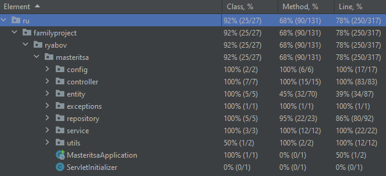
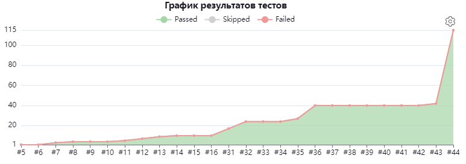

#           🔻🔻🔻ПРОЧИТАЙ ДО КОНЦА🔻🔻🔻
# Добро пожаловать на страницу проекта сайта для украшений ручной работы. 🙋‍♂️
## Данный проект является учебным. Стек проекта 🖥️
- Maven
- Spring Boot, Spring Web, Spring Security
- JUnit5, Mockito
- Postgresql
- Hibernate
- Thymeleaf

## Состояние проекта на данный момент ✅
- 100% покрытие unit-тестами слоя сервисов
- 100% покрытие unit-тестами слоя контроллеров
- 86% покрытие unit-тестами слоя репозитория
- Написаны интеграционные тесты по каждому эндпоинту
- Написание документации javadoc на каждый класс на русском языке и английском языке
- Подключение Thymeleaf и вывод с его помощью данных из БД
- Автоматизация тестирования за счет Jenkins
- Проведена адаптация сайта под мобильные устройства
- Проведена оптимизация CSS-кода
- Добавлен функционал регистрации/авторизации аккаунта и страница аккаунта

## Планы на ближайшее будущее (до конца января) 📓
- Кидать между слоями приложения DTO, а не entity
- Подключить к проекту Liquibase
- Добиться 80% покрытия unit-тестами
- Добавить в свой стек проекта фреймворк Selenide
- Добавить модуль мониторинга статистики сайта (скорее всего от Яндекса)

## Написание тестов🔧
В данный момент покрытие unit-тестами составляет 78%.

  

  

